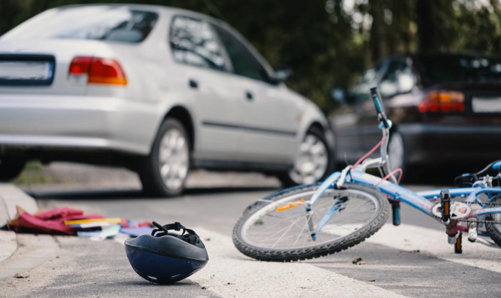
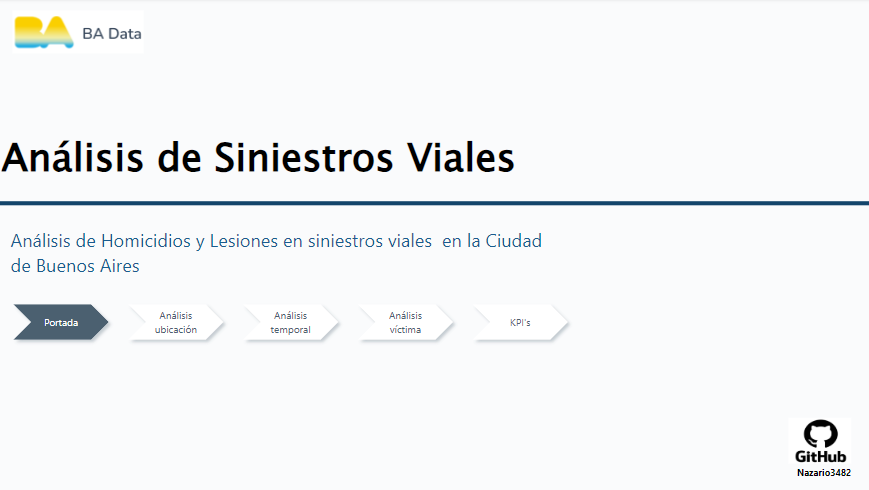
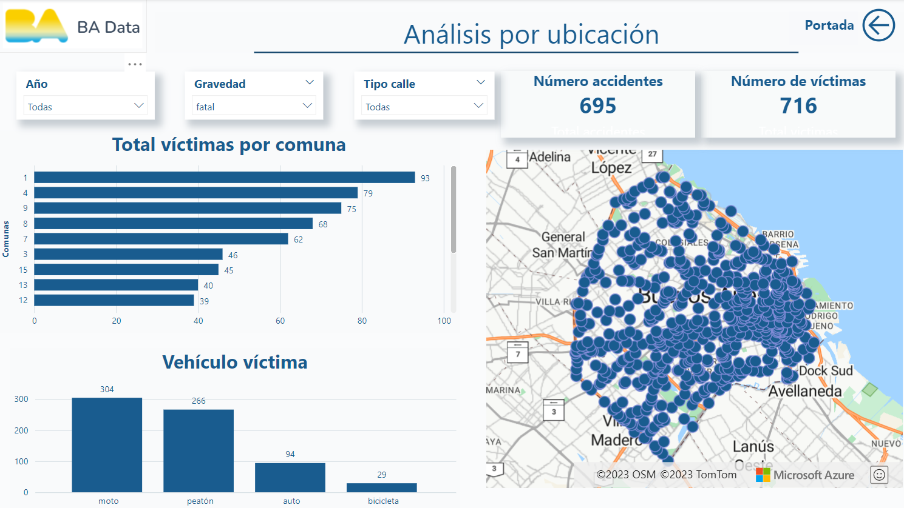
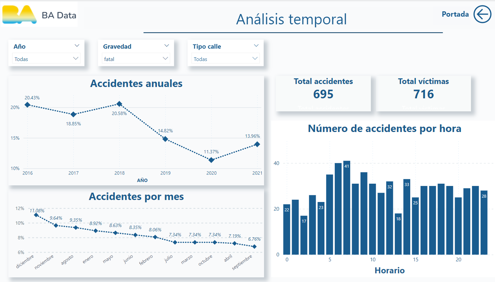
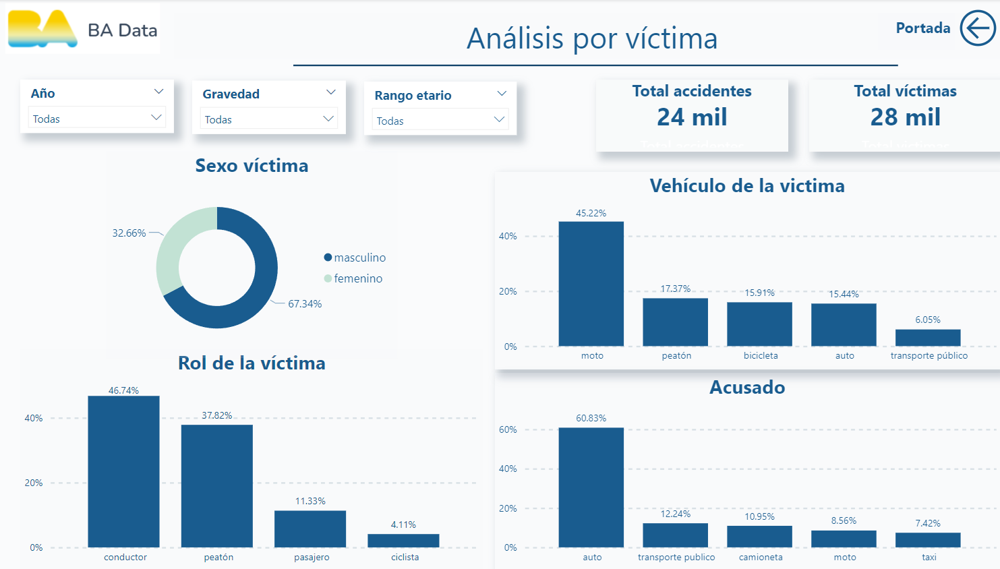
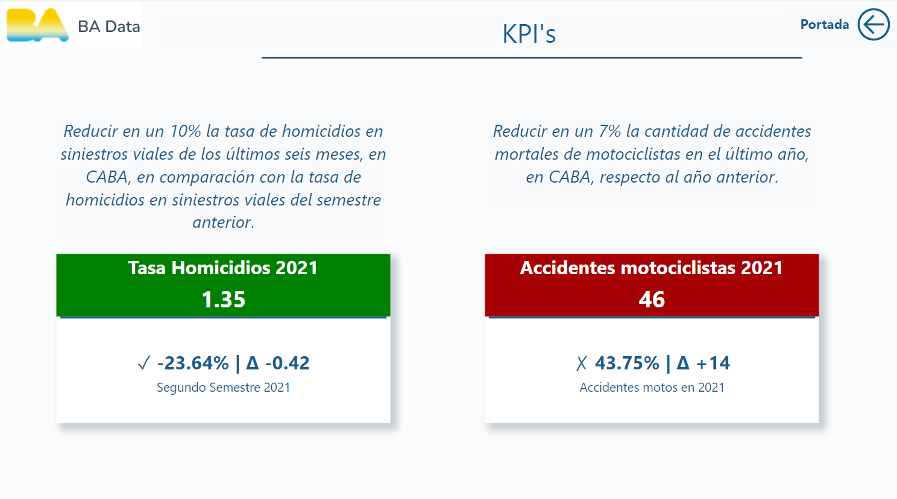
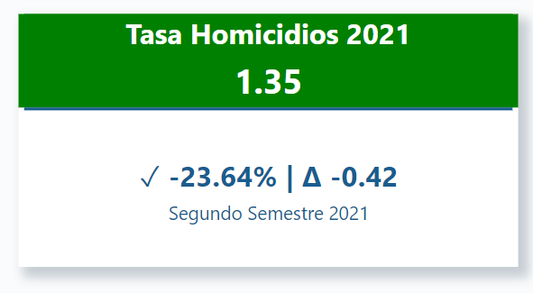
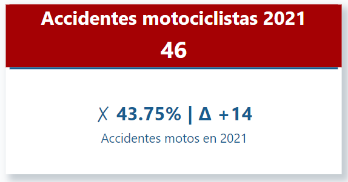

# Análisis de Datos de Siniestros Viales en la Ciudad de Buenos Aires

## Descripción del Proyecto

El principal objetivo  de este proyecto es identificar información importante que pueda ayudar a reducir los accidentes fatales en la ciudad de Buenos Aires. Para lograrlo, se llevó a cabo un análisis integral de los datos proporcionados por el Departamento de Transporte, la Subsecretaría de Planificación de Movilidad y la Oficina de Supervisión de Movilidad y Seguridad Vial de 2016 a 2021. 

Información extraída de la siguiente página: 
- https://data.buenosaires.gob.ar/dataset/victimas-siniestros-viales

## Desarrollo del proyecto

**ETL** : Durante el proceso de ETL se mantuvieron registros de casos y víctimas de asesinato y agresión. En este punto se eliminaron las columnas irrelevantes, los valores "SD" se convirtieron a valores nulos, se cambiaron los tipos de datos y se estandarizaron los nombres de las columnas y los datos. Se utiliza la nomenclatura "snake_case" con todos los nombres escritos en minúsculas y los espacios reemplazados por guiones bajos. 

Para obtener detalles específicos, consulte el notebook [ETL](/Notebooks/ETL.ipynb).

**EDA** :Durante el análisis exploratorio de datos (EDA) se identificaron patrones interesantes que proporcionaron información valiosa sobre la naturaleza de los datos. Los detalles concretos de estos resultados se detallan en el notebook [EDA](Notebooks/EDA.ipynb). 

**Dashboard**:

En el programa Power BI  se crearon cuatro páginas, incluida la portada. Estas páginas brindan información detallada sobre la ubicación, el momento y las características de las víctimas. Además, hemos agregado una página  que muestra los indicadores clave de desempeño (KPI) del proyecto para brindar una descripción general y completa de los resultados. El dashboard creado se encuentra en este repositorio.

Recomendamos descargar el panel para acceder a información más detallada y  una experiencia interactiva. [Dashboard](Dashboard.pbix)

#### Portada del Dashboard
Página principal que da la bienvenida y proporciona una visión general del contenido.

####  Página de ubicacion

Detalles sobre la ubicación de los incidentes,  a través del mapa y otras visualizaciones relacionadas con la ubicación del hecho.

####  Página de análisis temporal

Información relacionada con el aspecto temporal de los eventos, explorando tendencias y patrones a lo largo del tiempo.

####  Página de víctimas

Datos sobre las características de las víctimas

####  KPI (Indicadores Clave de Desempeño)

Página dedicada a los Indicadores Clave de Desempeño, proporcionando métricas clave para evaluar la reducción de accidentes.

### Hallazgos

- En la mayoría de los años de los que tenemos datos, la comuna con mayor fatalidad es la número 1; sin embargo, en el año 2021, la comuna con más fatalidades fue la 4.

- El vehículo de la víctima en los accidentes fatales en las autopistas más probable es la motocicleta, mientras que en las calles son los peatones.

- En accidentes no fatales, el vehículo de la víctima más probable tanto para autopistas como para calles es la motocicleta.

- En promedio, en los accidentes fatales hay 1.03 víctimas, mientras que en los accidentes no fatales hay 1.15 víctimas.

- Las comunas con menos accidentes fatales son la 5 y 6, mientras que la comuna con menos accidentes no fatales es la 2.

- Las comunas más peligrosas para los peatones son la 1, 4, 15, 3, 14 y 7.

- Los accidentes fatales se redujeron significativamente en el año 2020, posiblemente debido al confinamiento por la pandemia. De todos modos, se observa una tendencia bajista desde el año 2016.

- El mes con mayor cantidad de accidentes fatales es diciembre, y el mes con menos accidentes fatales es septiembre.

- El mes con mayor cantidad de accidentes no fatales ocurre en diciembre, y el mes con menos accidentes no fatales es mayo.

- Ocurren más accidentes no fatales los días viernes, jueves y martes.

- Hay más víctimas del género masculino que del género femenino.

- Las víctimas fatales que tienen más de 50 años o menos de 18 años son, en su mayoría, peatones. En contraste, en los demás rangos de edad, la mayoría de los incidentes fatales el vehiculo de la víctima es la motocicleta.

## KPI's

**Reducir en un 10% la tasa de homicidios en siniestros viales de los últimos seis meses, en CABA, en comparación con la tasa de homicidios en siniestros viales del semestre anterior**

Se define como el número total de víctimas fatales que hay en dataset por cada 100,000 personas en un área geográfica durante un período de tiempo específico.

Para calcular este KPI, se realizó la comparación entre el penúltimo y último semestre de 2021.

  

La tasa de homicidios en siniestros viales durante el último semestre del 2021 fue de 1.35, lo que representa una reducción de 0.42, equivalente a un -23.64%. Esta disminución significa que se logró cumplir la meta de reducir el 10% de la tasa de accidentes viales en el segundo semestre del 2021.

### Recomendaciones para mejorar este KPI

- Derivado del análisis el vehiculo más peligroso es la motocicleta y el grupo de edad afectada comprende de los 18 a los 49 años, por lo tanto, se recomienda generar una campaña de concientización dirigida a los motociclistas de 18 a 49 años. La campaña debería informar sobre los riesgos de conducir una motocicleta sin casco, sin respetar las normas de tránsito y sin tomar las precauciones necesarias.

- En las calles, las víctimas principales son los peatones. Para disminuir el riesgo, se recomienda colocar pasos peatonales y semáforos , sobre todo en las comunas  1, 9, 13, 14, 2 y 3 donde la mayoría de las víctimas de las calles son peatones.

- El mes con mayor número de homicidios es diciembre. Para reducir el número de homicidios, se recomienda incrementar la vigilancia durante ese mes. 

**Reducir en un 7% la cantidad de accidentes mortales de motociclistas en el último año, en CABA, respecto al año anterior.**

Definimos a la cantidad de accidentes mortales de motociclistas en siniestros viales como el número absoluto de accidentes fatales en los que estuvieron involucradas víctimas que viajaban en moto en un determinado periodo temporal. Su fórmula para medir la evolución de los accidentes mortales con víctimas en moto es: (Número de accidentes mortales con víctimas en moto en el año anterior - Número de accidentes mortales con víctimas en moto en el año actual) / (Número de accidentes mortales con víctimas en moto en el año anterior) * 100

El aumento del 43.75% de accidentes de motociclistas en 2021 con respecto a 2020 es un resultado muy negativo, y está muy lejos de la meta de disminuir un 7% los accidentes de motociclistas.

### Recomendaciones para mejorar este KPI

- La autopista es el lugar donde ocurren más accidentes donde la víctima es el motociclista. Por lo que una opción es instalar cámaras de seguridad en la autopista para identificar y sancionar a los conductores que cometan infracciones que puedan causar accidentes.

- En el 87% de los casos en los que la víctima era motociclista, también era el que iba conduciendo por lo que es necesario endurecer los requisitos para obtener el permiso de motocicleta. Esto podría incluir requisitos de edad mínima para conducir más estrictos, mayor tiempo de formación teórica y práctica y pruebas más rigurosas.

## Estructura del Repositorio

- 📂 **Datasets**: Contiene los conjuntos de datos utilizados para el análisis.
    - Archivos_mapas: Contiene la información para graficar el mapa de Buenos Aires en Python.
    - CSV: Contiene los archivos después de realizar el ETL.
    - Originales: Contiene los archivos que se descargaron.

- 📂 **Imagenes**: Contiene las imágenes utilizadas tanto para realizar el dashboard como para este repositorio.

- 📂 **Notebooks**: Contiene el código en Python de los pasos realizados durante el ETL y el EDA.

## Tecnologías

💻 Python
📊 Power BI
